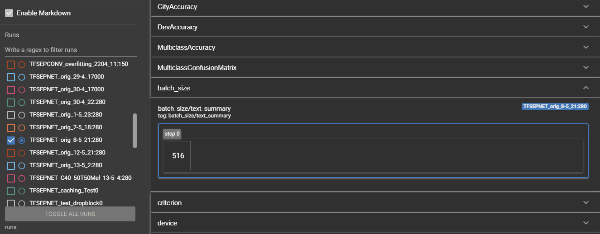
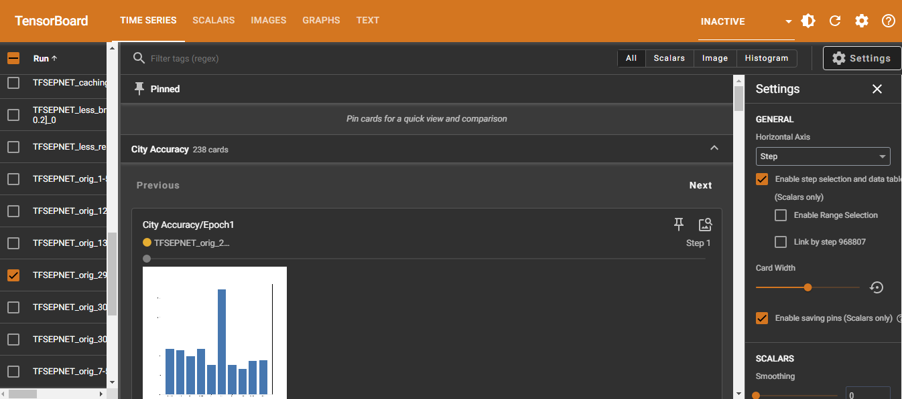

# DCASE-Task1
DCASE Task 1 project.
@dragonsearch @RodrigoJuanes

# What exactly is this?

This is the pytorch code for our experiments on the [DCASE Community Challenge for 2023](https://dcase.community/). Specifically on the [Task 1 Acoustic Scene Classification](https://dcase.community/challenge2023/).

# Ok, but how can this be useful to me?

I can see several options:

1. The most obvious one: you want to participate or use the [TAU Urban Acoustic Scenes 2022 Mobile, development dataset](https://zenodo.org/records/6337421) and so you want a full codebase to start with that is not cluttered with pytorch lightning or other modules like fastai or huggingface YET (note: there are torchmetrics, light tensorboard usage and optuna).

2. You want some of the transformations/metrics we implemented for your own projects.

3. You want to start work on audio/video and need a [cached dataset](https://github.com/dragonsearch/DCASE-Task1/blob/main/dataset/cached_dataset.py) for your spectrograms and transforms.

4. You are just lurking what has been done, which is completely fine as this can be a good summary/introduction to those works.

# Can you tell me in more detail?

## What is the task?

It is an audio classification problem into different "scenes", for example, a park or a metro station on a variety of recording devices. **BUT** with limited compute and memory:

- 30 MMAC  for inference
- 128KB memory usage for parameters

More details in [Task description](https://dcase.community/challenge2023/task-low-complexity-acoustic-scene-classification)

## And what is this repo?

This repo has been used for replicating some of the results and implementations of participants from the 2023 edition.

In particular: 
- [https://dcase.community/challenge2023/task-low-complexity-acoustic-scene-classification-results#Schmid2023](Winner: team CP-JKU)
- [https://dcase.community/challenge2023/task-low-complexity-acoustic-scene-classification-results#Cai2023](Second place team: Cai) 

### What implementations in particular and why are they useful?

- [Cached dataset](https://github.com/dragonsearch/DCASE-Task1/blob/main/dataset/cached_dataset.py):

**Why are you using a cached dataset?**

- Speed, training, research and prototyping the hyperparams is way faster. Mel Spec calculation (STFT in particular) computationally expensive.

**Why not use a cached dataset?**

Transforms are fixed once caching has been done. In particular:

- **Mel_Spectrogram parameters** like max/min frequencies, bins, hops and sample rates are not changing for the entirety of the training. -> Less diversity in spectrograms for our NN.

This is somewhat fixable by caching using different spectrogram configs, but still not ideal.

In any case for the Mel_Spectrogram, it is common to use fixed parameters on the original samples.

This is also true for all of the other transforms, that's why there is a skipcache parameter, which makes them skippable so those transformations are not fixed. 

#### [Shifted Crops](https://github.com/dragonsearch/DCASE-Task1/blob/main/dataset/transforms.py#L173)

**The TAU Urban 2022 dataset** is split into 1s segments of audio from original audios of 10s. The purpose of this transform is:

1. Gather those 10 files from the 'meta.csv'.
2. Join them and roll the audio in some intervals (default 10 intervals of 0.1s).
3. Apply a given transformation (usually mel spectrogram)
4. Save them to the 'data/cache/shifted/' folder

Which is **a bit different than what CP-JKU did**. We split the data in more segments and randomly sample from them, instead of a fixed roll size. Additionally, it is being cached so it has a considerable speed improvement in our tests.

- Increases diversity in the training data. Helps preventing overfitting.
- Does not add artificial noise. Audio timeline does not change at all. The samples are more varied in the time spectrum by a factor of 10 (default). We recommend a factor of 5.
- It is necessary to first cache separately this transform before calling.

This can be easily modified for the samples to be generated while training.

#### [MixUp](https://github.com/facebookresearch/mixup-cifar10) and Freq-MixStyle:

Essentially Freq-MixStyle is a little modification on [MixStyle](https://github.com/KaiyangZhou/mixstyle-release) that CP-JKU did that allows it to work on the frequency channel only, instead of mixing the time channel. 

Implementations for MixUp and Freq-MixStyle are straightforward:

- We decided that MixUp training should have its own class ([TrainerMixUp](https://github.com/dragonsearch/DCASE-Task1/blob/main/core/train/trainer_mixup.py#L7)).
- We decided that Freq-MixStyle was better as a function inside each model class.

In our experiments, using Freq-MixStyle was usually mandatory for good results:
- More robust to different recording devices.

and MixUp didn't have any meaningful impact.

#### Device Impulse Response Augmentation

Implemented as a convolution using a randomly sampled Impulse Response (''device noise'') from the [MicIRP](https://micirp.blogspot.com/) dataset as kernel:
- Examples are extracted from device 'a', as there are more 'real' samples of it.
- Further increases device robustness by a minor margin.

#### Metrics

Implemented through the `torchmetrics` template, it is a `Metric` object that performs tensor/torch operations. For this dataset:

- CityAccuracy: Requires num_cities=10. 
- DevAccuracy: Requires num_devices=9. 

#### Tensorboard support

# You got me in, now what?

**For codebase**: export QT_QPA_PLATFORM=offscreen

